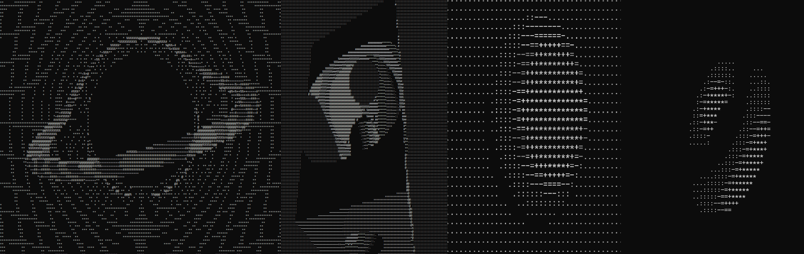

# ray0

A GLSL-like renderer on the terminal.



## Examples

```bash
# Color gradient test program
make gradient

# Simple sphere
make sphere

# Raymarch a rotating donut
make donut

# Raymarch a rotating 3d object
make composition

# Blackhole
make blackhole
```

## Usage

The shader function works the same as a typical GLSL fragment shader with the
main exception of `fragColor`, which is unidimensional instead of being a vec4
(but still normalized).

The function will run on each fragment from left to right and top to bottom.

Here is a basic test program

```cpp
#include "ray0.hpp"

const vec2 iResolution = {25, 25};

void shaderUVTest(float &fragColor, const vec2 &fragCoord) {
  const vec2 uv = (fragCoord - 0.5 * iResolution) / iResolution.y;

  if (sqrt(uv.x * uv.x + uv.y * uv.y) < .4) {
    float one = 0.25, two = 0.5, three = 0.75, four = 1.;
    if (fragCoord.x > iResolution.x / 2) {
      fragColor = fragCoord.y > iResolution.y / 2 ? one : two;
    } else {
      fragColor = fragCoord.y > iResolution.y / 2 ? three : four;
    }
  }
}

int main() {
  Engine engine(iResolution);
  engine.update(shaderUVTest, 4);
  engine.render("3210 ");

  return 0;
}
```


You can test the equivalent GLSL code
[here](https://www.shadertoy.com/view/lc3BWl).

```glsl
void mainImage( out vec4 fragColor, in vec2 fragCoord )
{
    vec2 uv = (fragCoord - 0.5 * iResolution.xy) / iResolution.y;
    float col = 0.;
    if (length(uv) < 0.4) {
        float one = 0.25, two = 0.5, three = 0.75, four = 1.0;
        if (fragCoord.x > iResolution.x / 2.) {
            col = fragCoord.y > iResolution.y / 2.0 ? one : two;
        } else {
            col = fragCoord.y > iResolution.y / 2.0 ? three : four;
        }
    }

    fragColor = vec4(col, col, col, 1.);
}
```
